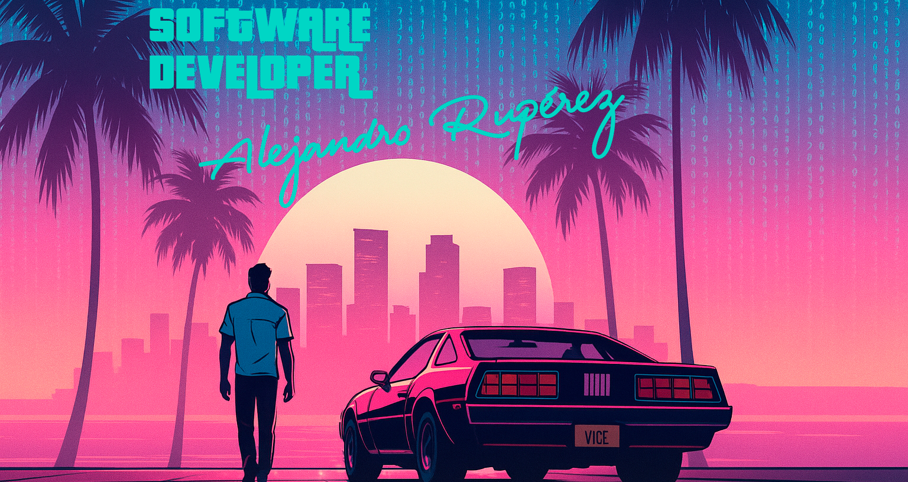

Hi there! I´m Alejandro Rupérez

🔄 I transitioned from IT infrastructure to software development because I’d rather build solutions than reboot servers

👨‍💻 Currently working as a Software Developer at ASPA Consulting with SAP ABAP and Java Spring

📱 In my spare time, I build mobile apps like [PlayCoach](https://github.com/RuperTech9/PlayCoach), an Android app for grassroots football coaches

🌱 Always learning — currently deepening my knowledge in Clean Code, design patterns, and hexagonal architecture

⚽ Beyond code, I’m passionate about football, strategy, continuous improvement, and team dynamics

---

### Languages & Technologies

**Languages**  

**Frameworks & Libraries**  

**Tools**  

**Platforms**  
-0FAAFF?style=flat&logo=sap&logoColor=white)

**Operating Systems**  

---

### 🤝 Let’s connect
If you're into clean code, well-crafted ideas...  
or just want to debate whether `var` or `val` is better,  
I'm around:

